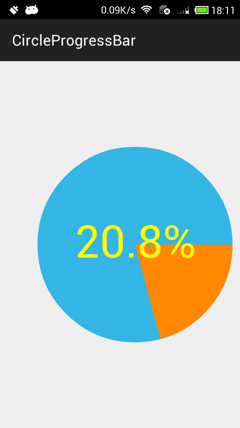

# CircleProgressBar
自定义的带百分比的圆形进度条



首先创建一个CircirProgressBar类继承自View，实现构造方法,在所有构造函数中统一调用init()方法来进行初始化操作。由于这个控件是自绘方式实现，所以需要覆盖View类的onDraw()方法。现在代码结构如下：

```
public class CircleProgressBar extends View {
    public CircleProgressBar(Context context) {
        super(context);
        init(context, null);
    }

    public CircleProgressBar(Context context, AttributeSet attrs) {
        super(context, attrs);
        init(context, attrs);
    }

    public CircleProgressBar(Context context, AttributeSet attrs, int defStyleAttr) {
        super(context, attrs, defStyleAttr);
        init(context, attrs);
    }

    @TargetApi(Build.VERSION_CODES.LOLLIPOP)
    public CircleProgressBar(Context context, AttributeSet attrs, int defStyleAttr, int defStyleRes) {
        super(context, attrs, defStyleAttr, defStyleRes);
        init(context, attrs);
    }

    private void init(Context c, AttributeSet attrs) {
        if (attrs == null) {
            return;
        }
    }

    @Override
    protected void onDraw(Canvas canvas) {
        super.onDraw(canvas);
    }
}
```

我的目标是自定义一个带百分比的圆形进度条，这其中有很多属性（例如进度条的背景色、前景色、最大值、当前值、文字的颜色和大小等），这些属性我希望暴露给外部，这样外部可以通过修改这些属性来改变控件的外观和行为。为了达到这一目的，需要将上面提到的属性以成员字段的方式定义在CircleProgressBar类中，并在init()方法中初始化这些字段（初始值暂时硬编码，后面会改为从XML布局中读取属性值）。

```
public class CircleProgressBar extends View {
    private float mMaxValue;
    private float mValue;
    private int mBackgroundColor;
    private int mProgressColor;
    private float mTextSize;
    private int mTextColor;

    ......

    private void init(Context c, AttributeSet attrs) {
        if (attrs == null) {
            return;
        }
        mMaxValue = 100;
        mValue = 30;
        mBackgroundColor = Color.GRAY;
        mProgressColor = Color.YELLOW;
        mTextSize = 30;
        mTextColor = Color.GREEN;

        mMaxValue = Math.max(0, mMaxValue);
        mValue = Math.max(0, Math.min(mMaxValue, mValue));
    }
}
```

现在已经具备了必要的属性值，可以在onDraw()方法中开始绘制工作了，绘制过程非常简单，先计算出圆形的半径和中心点，然后依次画背景（圆形）、前景（扇形）和百分比（文字）。在onDraw()函数中绘图时记住，当前的坐标原点是控件的左上角，实际可绘制的区域需要排除掉控件的Padding区域，如果不知道可以参考CSS中的盒模型，如下图：

```
@Override
protected void onDraw(Canvas canvas) {
    super.onDraw(canvas);

    int width = getMeasuredWidth() - getPaddingLeft() - getPaddingRight();
    int height = getMeasuredHeight() - getPaddingTop() - getPaddingBottom();
    float radius = Math.min(width, height) / 2.0f;
    float percentage = mValue / mMaxValue;
    float cx = width / 2.0f + getPaddingLeft();
    float cy = height / 2.0f + getPaddingTop();

    // 画进度条背景色(圆形)
    mPaint.setColor(mBackgroundColor);
    canvas.drawCircle(cx, cy, radius, mPaint);

    // 画进度条前景色(扇形)
    mPaint.setColor(mProgressColor);
    RectF rect = new RectF(cx - radius, cy - radius, cx + radius, cy + radius);
    canvas.drawArc(rect, 0.0f, percentage * 360.0f, true, mPaint);

    // 画百分比文字（注意：drawText 函数的坐标系中垂直向上为Y轴正方向，这与Android坐标系相反）
    mPaint.setColor(mTextColor);
    mPaint.setTextSize(mTextSize);
    String text = String.format("%.1f%%", percentage * 100);
    float fontHeight = mPaint.measureText("0");     // 测量单个字符的宽度作为高度，有点粗糙，不过没关系
    canvas.drawText(text, cx - mPaint.measureText(text) / 2.0f, cy + fontHeight/2.0f, mPaint);
}
```

Ok！一个自定义控件已经初步成型了，不过外部不能修改其属性以改变其外观，所以这里对属性提供相应的getter和setter方法，这个就不需要贴代码了，用工具自动生成即可。注意：使用setter修改控件属性后，记得调用View的`invalidate()`方法，该方法会导致控件重绘，这样就可以立马看到修改后的效果了。

Android自定义的控件除了可以通过代码设置其属性，也可以直接在XML布局文件中设置属性并实时预览效果，这非常方便，我的控件也要做到这样。要实现这个也不难，首先需要声明自定义的属性，然后就可以在XML布局文件中使用你声明的属性，这些属性值会传递给控件构造函数的第二个参数，这个参数是一个AttributeSet类型，在构造函数中从该参数中提取出自定义的属性值然后更新控件的属性值从而改变控件的外观。说归说，下面就开始做吧。

#### （1）声明控件属性

自定义的控件属性需要在<declare-styleable>标签内进行声明，<declare-styleable>标签需要放在<resource>标签内，一般自定义的属性存储文件命名为`attrs.xml`。<declare-styleable>的`name`属性是自定义控件的类名，表示这一组控件属于该控件类，每个子标签<attr>包含两个属性值：

* name（必选）属性名称，我们在XML文件中设置控件属性时使用该名称
* format（可选）属性的取值类型，常见的有Float、Integer、color、dimensione、enum等

```
<?xml version="1.0" encoding="utf-8"?>
<resources>
    <declare-styleable name="CircleProgressBar">
        <attr name="maxValue" format="float"/>
        <attr name="value" format="float"/>
        <attr name="backgroudColor" format="color"/>
        <attr name="progressColor" format="color"/>
        <attr name="textSize" format="dimension"/>
        <attr name="textColor" format="color"/>
    </declare-styleable>
</resources>
```

#### (2)提取自定义属性

我们在XML布局文件中定义控件时，设置的各种属性可以在控件的构造函数的第二个参数AttributeSet中获取。`R.styleable.CircleProgressBar`是一个int[]类型，存储了自定义属性的在AttributeSet中的索引值。`R.styleable.CircleProgressBar_XX`是一个int类型，表示前面int[]数组的下标值，这个是IDE自动生成。

```
private void init(Context c, AttributeSet attrs) {
    if (attrs == null) {
        return;
    }

    TypedArray typedArray = c.obtainStyledAttributes(attrs, R.styleable.CircleProgressBar);
    mMaxValue = typedArray.getFloat(R.styleable.CircleProgressBar_maxValue, 100.0f);
    mValue = typedArray.getFloat(R.styleable.CircleProgressBar_value, 0.0f);
    mBackgroundColor = typedArray.getColor(R.styleable.CircleProgressBar_backgroudColor, Color.GRAY);
    mProgressColor = typedArray.getColor(R.styleable.CircleProgressBar_progressColor, Color.YELLOW);
    mTextSize = typedArray.getDimensionPixelSize(R.styleable.CircleProgressBar_textSize, 12);
    mTextColor = typedArray.getColor(R.styleable.CircleProgressBar_textColor, Color.WHITE);

    mMaxValue = Math.max(0, mMaxValue);
    mValue = Math.max(0, Math.min(mMaxValue, mValue));

    typedArray.recycle();
}
```

#### (3)在XML布局文件中使用

自定义的控件属性所在的xml命名空间是"http://schemas.android.com/apk/res-auto"，为该命名空间取一个别名（例如下面的"app"，你也可以取其他名字没关系），之后通过"app"这个命名空间来设置控件自定义的属性，就像使用"android:"这个命名空间一样，例如下面代码，设置之后的控件效果就是前面一开始的效果图。

```
<RelativeLayout xmlns:android="http://schemas.android.com/apk/res/android"
                xmlns:app="http://schemas.android.com/apk/res-auto"
                android:layout_width="match_parent"
                android:layout_height="match_parent"
                android:gravity="center" >

    <com.whinc.circleprogressbar.CircleProgressBar
        android:layout_width="wrap_content"
        android:layout_height="wrap_content"
        android:paddingLeft="50dp"
        android:paddingRight="10dp"
        app:maxValue="100"
        app:value="70"
        app:backgroudColor="@android:color/holo_blue_light"
        app:progressColor="@android:color/holo_orange_dark"
        app:textSize="60sp"
        app:textColor="#FF0"
        />
</RelativeLayout>
```

#### 参考
